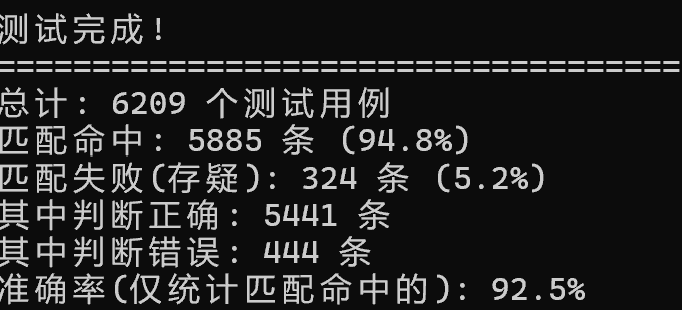

# 求真眼 (QiuZhenYan)

> AI生成内容可信度检测插件 —— 纯规则引擎，毫秒级响应，无需联网

## 📖 项目简介

"求真眼"是一个基于规则匹配的事实核查引擎，用于检测AI生成内容是否可信。它不依赖任何外部API，完全本地运行，毫秒级响应，适合嵌入各类AI平台。

## ✨ 核心特点

- ⚡ **纯本地运行**：无需联网，无需API Key
- 🚀 **毫秒级响应**：规则匹配，无推理延迟
- 📊 **高准确率**：6209条测试用例，匹配命中准确率92.5%
- 🔄 **可持续扩展**：支持通过CSV/TXT文件批量添加规则
- 🎯 **三级输出**：可信 ✅ / 存疑 ⚠️ / 不可信 ❌

## 📊 测试结果

基于 TruthfulQA 中文版数据集进行规模化测试：

| 指标 | 结果 |
|------|------|
| 总测试用例 | 6,209 条 |
| 规则匹配覆盖率 | 94.8% |
| 匹配命中准确率 | **92.5%** |
| 正确判断 | 5,441 条 |
| 错误判断 | 444 条 |

## 🚀 快速开始

安装依赖：`pip install flask flask-cors`。启动服务：`python app.py`。调用API：`curl -X POST http://127.0.0.1:8080/check -H "Content-Type: application/json" -d '{"question": "中国的首都是哪里？", "answer": "北京"}'`，返回示例：`{"level": "可信 ✅", "message": "中国的首都是哪里？"}`。

## 📁 规则扩展

将新的CSV/TXT数据文件放入 `new_data/` 文件夹，运行 `python auto_rule_generator.py`，系统会自动提取规则并合并到规则库。

## 📄 许可证

MIT License

## 🤝 贡献

欢迎提交 Issue 和 Pull Request！

---

**Made with ❤️ by qiuzhenyan**
